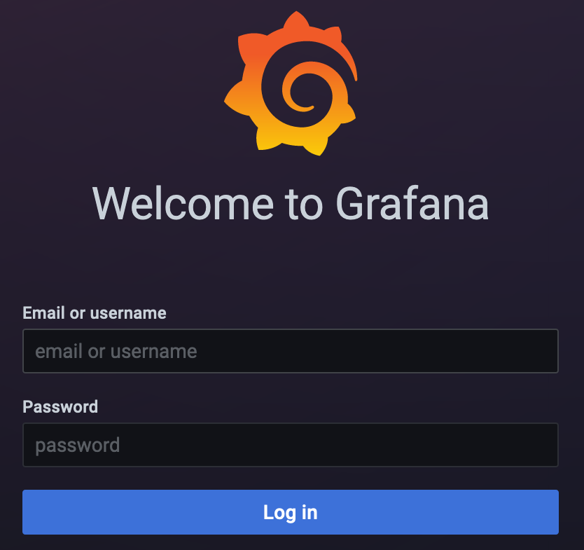
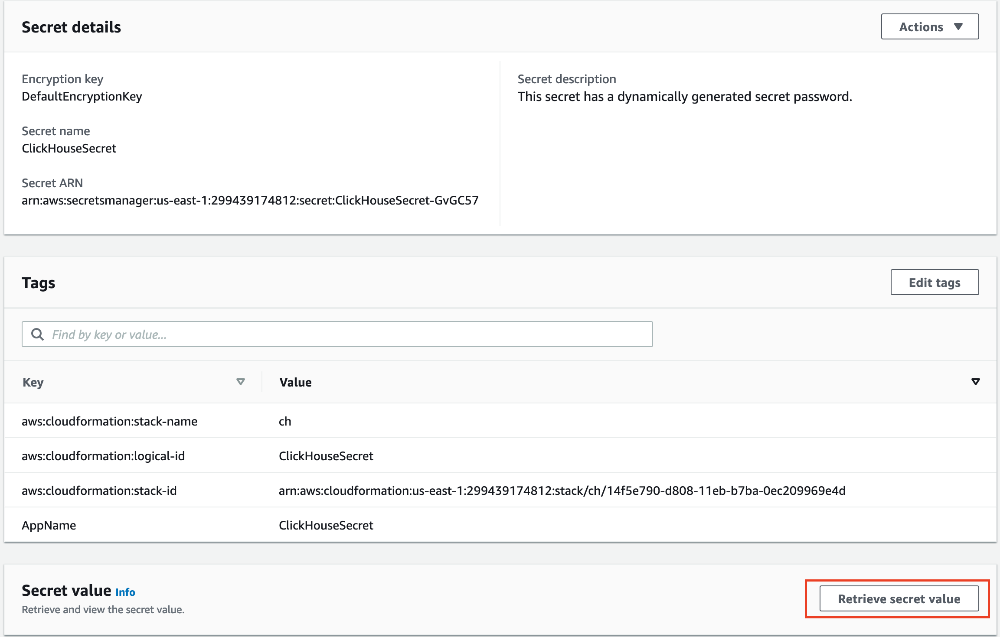

// Add steps as necessary for accessing the software, post-configuration, and testing. Don’t include full usage instructions for your software, but add links to your product documentation for that information.
//Should any sections not be applicable, remove them

=== Logging into a ClickHouse server node

. Locate your private key file. The key used to launch such as clickhouse.pem. Run following command to ensure your key is not publicly viewable.

[source,bash]
--
chmod 400 ./clickhouse.pem
--

[start=2]
. Upload the PEM key pair from local to the bastion host. For example:

[source,bash]
--
scp -i "clickhouse.pem" ./clickhouse.pem ec2-user@ec2-11-11-11-11.compute-1.amazonaws.com:/home/ec2-user
--

[start=3]
. Sign into the bastion host.

[source,bash]
--
ssh -i "clickhouse.pem" ec2-user@ec2-11-11-11-11.compute-1.amazonaws.com
--

:xrefstyle: short
[start=4]
. Get the IP address from the Amazon EC2 console.
.. Open the https://console.aws.amazon.com/ec2/[Amazon EC2 console].
.. On the *Instances* screen, select the checkbox for the instance. Note the *Private IPs* in the *Description* tab, as shown in <<IPaddress>>.

[#IPaddress]
[link=images/ec2.png]
.EC2 instance private IP address
image::../images/ec2.png[ClickHouseClientAddress,width=75%,height=75%]

[start=5]
. From the bastion host, make sure the PEM key pair file in the current bastion host directory and log into the client node with the IP address. For example:

+
[source,bash]
----
(ec2-user@ip-11-11-11-11) $ ssh -i "clickhouse.pem" ec2-user@ec2-22-22-22-22.compute-1.amazonaws.com

       __|  __|_  )
       _|  (     /   Amazon Linux 2 AMI
      ___|\___|___|

https://aws.amazon.com/amazon-linux-2/
No packages needed for security; 2 packages available
Run "sudo yum update" to apply all updates.
[ec2-user@ip-22-22-22-22 ~]$
----
+

[start=6]
. Once you are signed into the client node, you can use https://clickhouse.tech/docs/en/interfaces/cli/[ClickHouse command-line client] to query, manage, and diagnose issues.

=== Viewing the Grafana web console in a browser

The default deployment installs the Grafana web console on the ClickHouse client host which in the private subnets, they cannot be accessed directly through a browser. To access port 3000 of the private IP address of the Grafana server, configure an SSH connection with the bastion host SSH tunnel. Then use the SSH tunnel to access the web console. 

[#step1]
. Establish a connection with the bastion host using SSH with the following command. Replace `_port number_`, `_key pair.pem_`, `_user name_`, and `_host name_` with your parameters.

+
`ssh -qTfnN -D _port number_ -i "_key pair.pem_" _user name_@_host name_`

+
For example:

+
`ssh -qTfnN -D 40011  -i "clickhouse.pem" \ec2-user@ec2-54-223-36-247.cn-north-1.compute.amazonaws.com.cn`

. Set up a proxy manager in your browser. There are many proxy manager plug-ins available. These instructions use SwitchyOmega.
.. Install the SwitchyOmega plug-in.
** https://microsoftedge.microsoft.com/addons/detail/proxy-switchyomega/fdbloeknjpnloaggplaobopplkdhnikc?hl=en-US[Microsoft Edge]
** https://addons.mozilla.org/en-US/firefox/addon/switchyomega/?utm_source=addons.mozilla.org&utm_medium=referral&utm_content=search[Firefox]
** https://chrome.google.com/webstore/detail/proxy-switchyomega/padekgcemlokbadohgkifijomclgjgif?hl=en-US[Google Chrome]

+

.. Open the SwitchyOmega options page and select *New Profile* in the left sidebar.

+

:xrefstyle: short
[#addprofile]
[link=images/SwitchyOmega1.png]
.Add new SwitchyOmega profile
image::../images/switchyOmega1.png[SwitchyOmega,width=50%,height=50%]

+
[start=3]
.. Enter a name and select *Create*.

+

:xrefstyle: short
[#profilename]
[link=images/SwitchyOmega2.png]
.Profile name
image::../images/switchyOmega2.png[SwitchyOmega,width=50%,height=50%]

+
[start=4]
:xrefstyle: short
.. Enter the *Protocol*, *Server*, and *Port* for proxy server. The port should be the local port where you set up the SSH tunnel in link:#_step1[step 1].

+

[#proxyserverinfo]
[link=images/SwitchyOmega3.png]
.Proxy servers
image::../images/SwitchyOmega3.png[SwitchyOmega,width=50%,height=50%]

+
[start=5]
.. Select *Apply Changes*. 
.. Access SwitchyOmega through the extension icon of your browser. Select your created profile in the proxy list. The browser will send all traffic through the local port 40011 proxy to the bastion host.

+

:xrefstyle: short
[#proxylist]
[link=images/SwitchyOmega4.png]
.Proxy list
image::../images/switchyOmega4.png[SwitchyOmega,width=50%,height=50%]

+

[start=3]
. To view the Grafana web console on the ClickHouse client host in your browser, navigate to `\http://10.0.xx.xx:3000`. Replace `xx.xx` with the private IP address of the client host. You can find the private IP address of the server named `ClickHouseAdminClient` in the EC2 console.

+
:xrefstyle: short
[#ec2console]
[link=images/ec2.png]
.Private IP address of the ClickHouse client host in the EC2 console
image::../images/ec2.png[ec2,width=90%,height=90%]

+

[#webconsole]
[link=images/GrafanaConsole.png]
.Grafana web console

[start=4]
. The username is admin, to get the password of Grafana web console, navigate to the CloudFormation stack console and click the outputs. You can find the link of the parameter named `DBPassword`.

+

[#cloudformationconsole]
[link=images/cloudformation_outputs.png]
.CloudFormation outputs
image::../images/cloudformation_outputs.png[console,width=90%,height=90%]

[start=5]
. Navigate to the Secrets Manager console and click the `Retrieve secret value`. You can find the password.

+

[#secretsmanagerconsole]
[link=images/secretsmanager.png]
.Secrets Manager console

=== ClickHouse resources

==== ClickHouse server nodes

* ClickHouse server installation directory: `/etc/clickhouse-server`
* ClickHouse server data directory in local file storage: `/home/clickhouse/data`
* ClickHouse server data directory in S3 bucket name like: `clickhouse-data-vpcid`
* Deployment script installation log used to troubleshoot error messages: `/home/ec2-user/ch-install.log`

==== ClickHouse client nodes
* ClickHouse client installation directory: `/etc/clickhouse-client`
* Deployment script installation log used to troubleshoot error messages: `/home/ec2-user/clickhouse-client-install.log`
* Grafana web console: `/etc/grafana`

==== Zookeeper server nodes

* Apache Zookeeper installation directory: `/usr/local/apache-zookeeper-3.5.9-bin/`
* Deployment script installation logs: `/home/ec2-user/zk.log`

== Best practices for using {partner-product-short-name} on AWS
// Provide post-deployment best practices for using the technology on AWS, including considerations such as migrating data, backups, ensuring high performance, high availability, etc. Link to software documentation for detailed information.

* https://clickhouse.tech/blog/en/2021/reading-from-external-memory/[A journey to io_uring, AIO and modern storage devices]
* https://habr.com/en/company/yandex/blog/457612/[How to speed up LZ4 decompression in ClickHouse]
* https://clickhouse.tech/blog/en/2021/fuzzing-clickhouse/[Fuzzing ClickHouse]
* https://habr.com/en/company/yandex/blog/485096/[Five Methods For Database Obfuscation]
* https://aws.amazon.com/cn/blogs/china/explore-three-ways-to-combine-clickhouse-and-amazon-s3/[Explore three ways to combine ClickHouse and Amazon s3]
