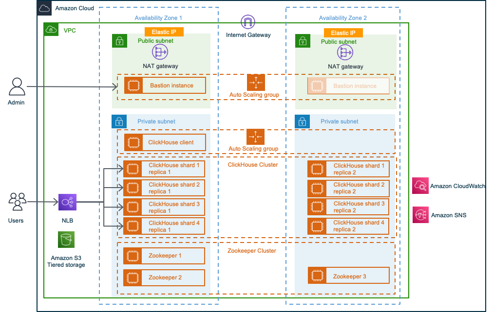

:xrefstyle: short

Deploying this Quick Start for a new virtual private cloud (VPC) with
default parameters builds the following {partner-product-short-name} environment in the
AWS Cloud.

[#architecture1]
.Quick Start architecture for {partner-product-short-name} on AWS

As shown in <<architecture1>>, the Quick Start sets up the following:

* A highly available architecture that spans two Availability Zones.*
* A VPC configured with public and private subnets, according to AWS best practices, to provide you with your own virtual network on AWS.*
** An internet gateway to allow internet access for bastion hosts.*
* In the public subnets:
** Managed network address translation (NAT) gateways to allow outbound internet access for resources in the private subnets.*
** A Linux bastion host in an Auto Scaling group to allow inbound Secure Shell (SSH) access to Amazon EC2 instances in public and private subnets.*
* In the private subnets:
** A ClickHouse client in an Auto Scaling group to allow administrators to connect to the ClickHouse cluster.
** A ClickHouse database cluster that contains Amazon EC2 instances.
** A ZooKeeper cluster that contains Amazon EC2 instances for storing metadata for ClickHouse replication. Each replica stores its state in ZooKeeper as the set of parts and its checksums. The default is three.
* Elastic Load Balancing for the ClickHouse cluster.
* An Amazon S3 bucket for tiered storage of the ClickHouse cluster.
* Amazon CloudWatch Logs to centralize ClickHouse logs and modify the log-retention policy.
* Amazon Simple Notification Service (Amazon SNS) for sending email notifications when an alarm triggers.
* AWS Secrets Manager to store dynamically generated passwords.

[.small]#* The template that deploys the Quick Start into an existing VPC skips the components marked by asterisks and prompts you for your existing VPC configuration.#
